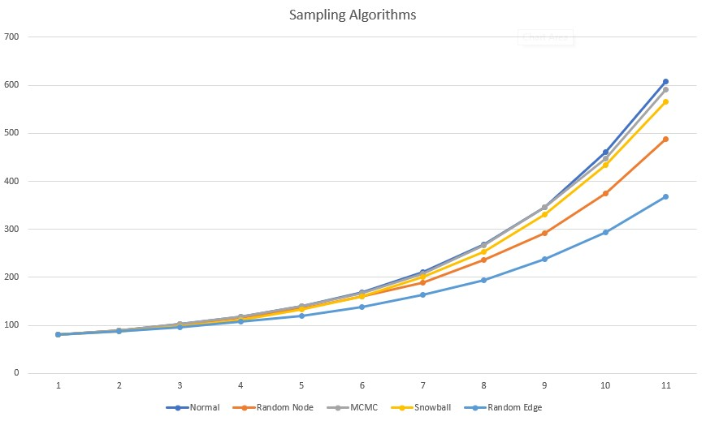
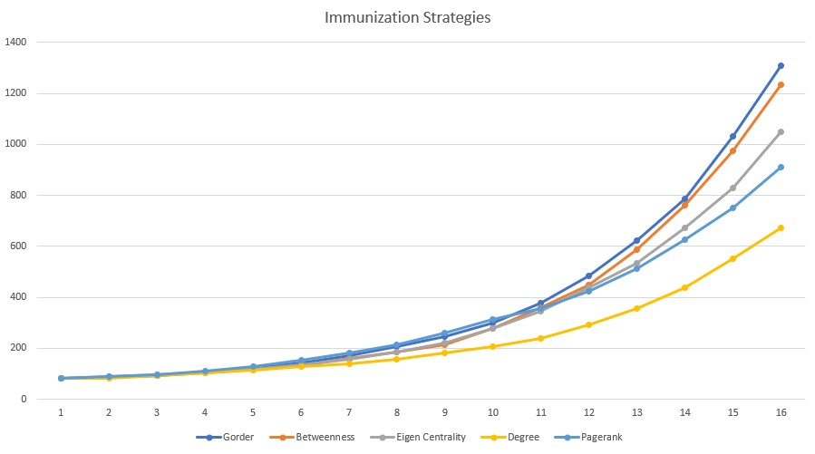

```{r setup, include=FALSE}
knitr::opts_chunk$set(echo = TRUE)

library(knitr)

```

# Introduction

The importance of epidemic modeling of infectious diseases has, throughout time, become more and more important to better design and proceed with immunization approaches.
As mentioned on [@immu2002], "population inhomogeneities can substantially enhance the spread of diseases, making them harder to eradicate and calling for specific immunization strategies". Aggravated by the complexity of these systems, the small-world property, i.e., the small average path lengths among any two nodes, and the large degree of local clustering are where such complexity resides.

Complete immunization of a given network is highly unlikely if not impossible, and targeted immunization without full knowledge of the network's connections is a hard task, however if the *epidemic threshold* is not reached by the rate of infection, the disease dies out, as it cannot transmit itself faster than the time of cure.
As such, this paper will explore several strategies for limited immunization of a network by crawling the network to sample it and further evaluate results of such sampling. 

With such weakness in mind, minimizing the risk of epidemic outbreaks is of the utmost importance and should be seen as a crucial step in finding the best immunization pattern. Nowadays, we have many networks available to us, either with Watts-Strogatz model and the Barabási and Albert model, or with networks provided by social networks that represent a closer to real life model of a society. 

In short, for this paper we will analyze the best strategies that allow us to achieve the total protection of the network even for extremely low fractions of successfully immunized individuals. Commonly, a technique used for this purpose is to direct vaccination to the nodes with the highest degree, however this solution might be neither perfect nor scalable, and, for this reason, this paper researches other possible immunization strategies, such as highest pagerank, betweenness centrality, or eigen centrality. 

Furthermore, as mentioned previously, we do not have full knowledge of the graph, leading to the need of portioning the graph into a more understandable sample. From here, we will evaluate which crawling strategy has outputed better results in terms of total fraction of infecteds after a finite amount of time.

\newpage

# Sampling in networks

While there is not enough computing power to process the giant data sets produced by the vast web-based services around the internet, it is widely known to be infeasible to directly analyze these, and, for such action, network sampling is needed.
Sampling networks, in a way that pertains the representativeness of the *community structure*, a widespread characteristic in most complex networks nowadays, from these services, producing copious amounts of data, is of the utmost importance for the understanding of such data as [@fenner2012a] also pertained in its work.

This paper will analyze the different forms of sampling, its subgraph representativity of the original network, and how the different samplings react to the infection spreading. First of all, the paper searched for three different networks, available at the Stanford Network Analysis Project, from which Facebook, Twitter and Epinions networks were selected. Secondly, the task must be to sample subgraph from these networks, in such a way that the subgraph is representative of the original or global graph. With this in mind, in this paper, even though the developed code is able to run every possible graph or subgraph network, running the analysis to all the networks would be too time-consuming, and, therefore, it is important to note that the Twitter network graph was selected for the experiments due to its size being neither too big nor too small, while being a directed graph.

The paper then proceeds to define 4 different sampling algorithms, with which all of them were expecting as arguments the original graph and the number of nodes desired, with the random walks, both for edges and nodes, also including whether or not to use Metropolis Hastings and the mode to run the `neighbors` function.


# Immunization

As described by the paper [@immu2002], for the estimate of the effect of a growing number of immune individuals of a complex network, this paper will also research the standard Susceptible-Infected-Susceptible (SIS) model, where a node serves as an individual and an edge as a connection, with the latter serving as a way point for an infection to disseminate.

After implementing the proposed model by [@immu2002], and, in order to test the targeted immunization scheme, this paper has chose to proceed with the networks for this experiments, opting for using real networks, as previously mentioned, provided by the Stanford Large Network Dataset Collection, not only to better guarantee the strength of our results, but also to differentiate ourselves from previous work, such as [@fenner2012a]. This model is generally used to study infections leading to endemic states with a stationary average density of infected individuals.

\newpage

# Methods

As per [@fenner2012a], we have developed two sampling algorithms, that have the objective of finding samples with the best expansion in the network in order to better represent the original communities. These were proposed as Snowball Expansion Sampling and  Markov Chain Monte Carlo simulation (MCMC) Expansion Sampling, where the first, when sampled, grows like a snowball, hence the name, therefore it is considered a greedy algorithm, and the second is commonly known as a standard technique to sample and evaluate probability distributions. Against these two sampling algorithms we will use Random Walk Node selection as well as Random Walk Edge selection, where, as their names convey, random nodes and edges are selected, respectively. 

In short, for this paper, four different sampling algorithms were developed, and were run to evaluate which crawling heuristic gathers the best result for the given network. To evaluate this, while using the Twitter network graph, provided by the Stanford Large Network Dataset Collection, the vaccination was ran ten times on the whole graph with simulations of ten iterations, averaging out the number of infecteds per iteration. These results were then compared with a run of ten times of the average of the number of infecteds per iteration for each one of the sampling algorithms, i.e., with the exact same conditions as the whole graph. It is very important to note that all sampling was made using around 2.45% of the total network, i.e., from the 81000 nodes present in the original network, all samples contained simply 2000 nodes.

As per the immunization techniques, we've tested against a range of methods for targeted immunization from vertice number, degree, betweenness, eigen_centrality and pagerank. The test environment for these was, like in previous tests, running ten times the vaccinations for each method with the simulations with these consequently.


# Results

From these four we have noticed that the most performant implementation is the Markov Chain Monte Carlo (MCMC) while also providing the best results in terms of closeness to the original network, i.e., it generates a good sample with good expansion properties that better represent the community structure of the original network.



Below is our implementation for the Markov Chain Monte Carlo (MCMC) Expansion Sampling.

```{r}
sample_expansion_mcmc <- function(graph, num) {
  n <- gorder(graph)
  p <- 10 * gsize(graph) / n * log10(n)
  nodes <- sample(as.numeric(V(graph)), 1)
  neighbours <- as.numeric(neighbors(graph, nodes, mode = "OUT"))
  max_nodes <- NA
  max_exp <- 0
  exp <- length(neighbours) / (n - length(nodes))
  for (iter in seq(num)){
    repeat {
      v <- sample(setdiff(1:n, nodes), 1)
      new_nodes <- append(nodes, v)
      neighbours <- unique(setdiff(append(neighbours, as.numeric(neighbors(graph, v))), nodes))
      exp_new <- length(neighbours) / (n - length(nodes))
      if (runif(1) < min(1, exp_new / exp) ** p) {
        nodes <- new_nodes
        exp <- exp_new
        if (exp > max_exp) {
          max_nodes <- nodes
          max_exp <- exp
        }
        break
      }
    }
  }
  return(induced.subgraph(graph, max_nodes))
}
```

The following tests executed for this paper were to crawl part of the graph and determine which nodes to vaccinate during the crawl, and, consequently, evaluating which crawling strategy leads to better results in terms of total fraction of infecteds after a finite amount of time.



As we can see, even though Pagerank is very close, the Highest Degree remains the best immunization strategy.

\newpage

# Conclusion

The obtained results demonstrate that the networks susceptibility to epidemic spreading is heavily echoed by the sampling algorithm, as well as the immunization techniques, while being clear that there are algorithms and techniques that have a greater and far better representative impact of the simulation of the spread of a disease. After all the long experiments two affirmations can be made, Markov Chain Monte Carlo (MCMC) is the superior sampling algorithm, by being high performant while being well representative of the original network. In addition, the Highest Degree is the best immunization strategy in order to minimize infection spreading.

# References

